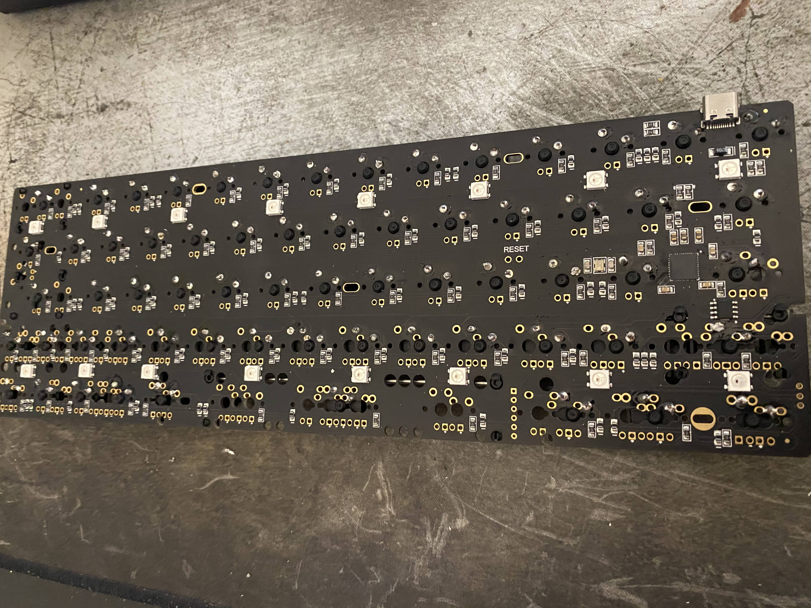
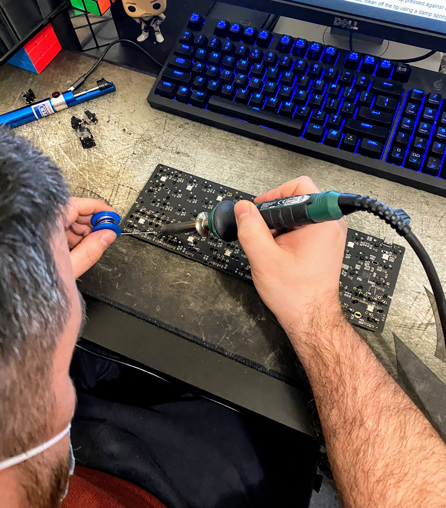
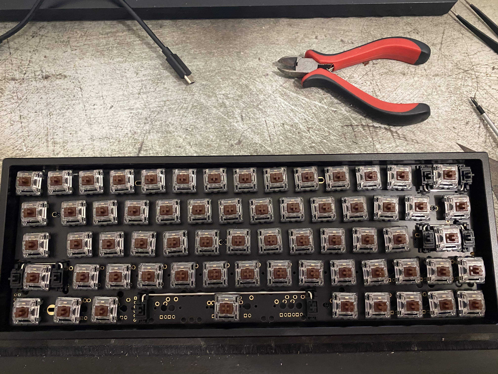
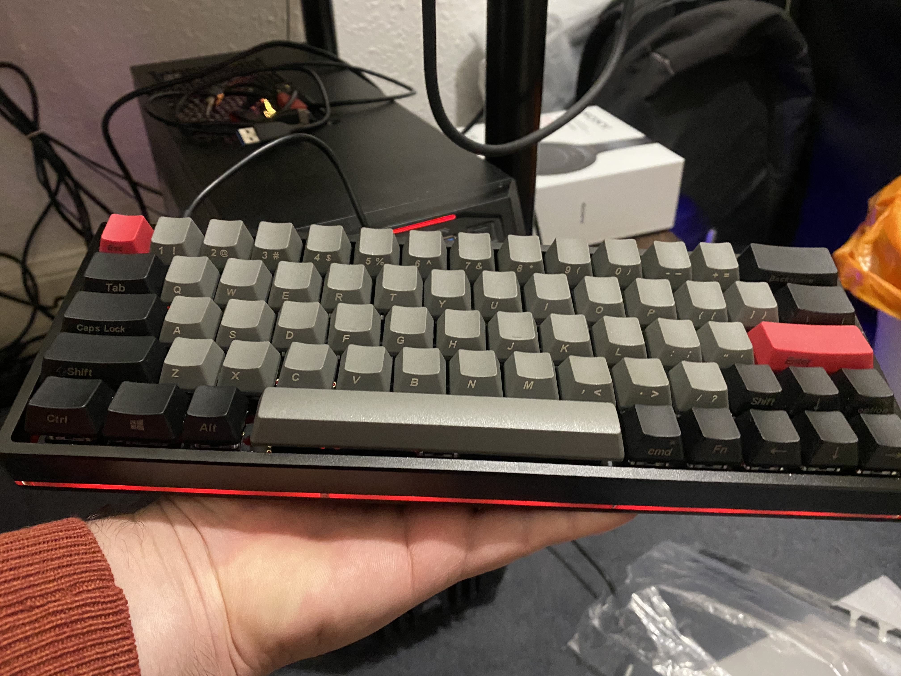
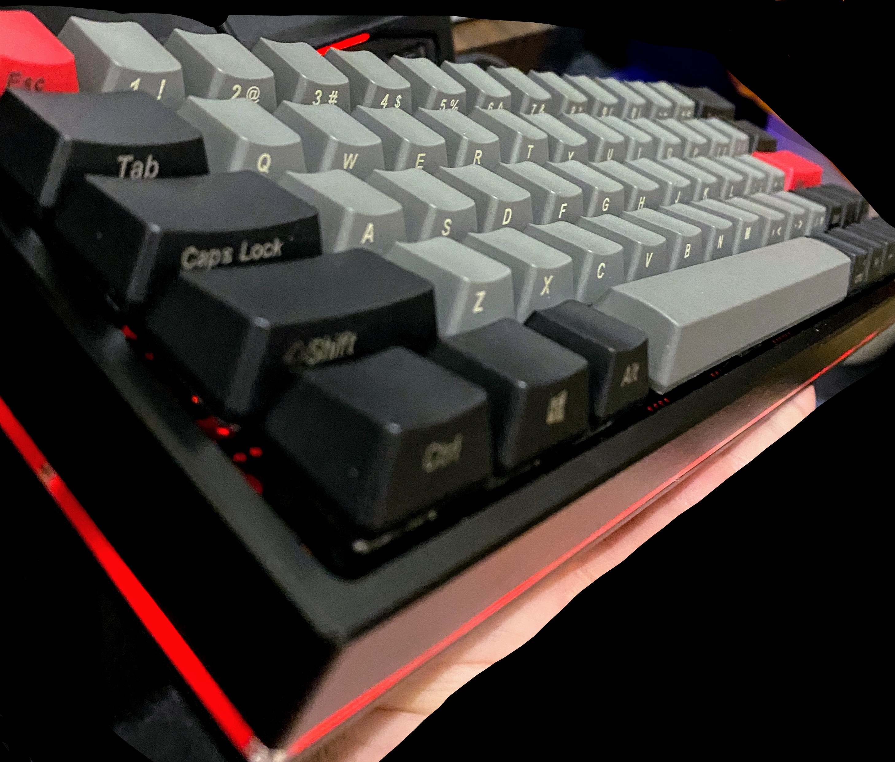
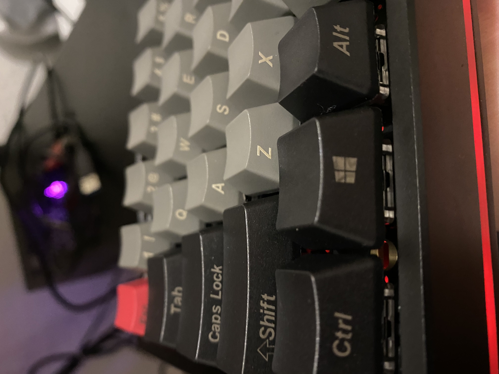

# My first DIY mech keyboard build

## Build details

- **PCB** - DZ60 60% PCB with type-C and underglow RGB LEDs, [Banggood](https://www.banggood.com/buy/dz60-pcb.html) - 40 EUR
- **Switches** - 70 Gateron brown 3pin switches (12eur), [KBDFans](https://kbdfans.com/) - 12 EUR
- **Stabilizers** - Cherry PCB-Mount Stabilizers [KBDFans](https://kbdfans.com/) - 15 EUR
- **Keycaps** - 117KEY OEM profile Dolch PBT keyset, [KBDFans](https://kbdfans.com/) - 30 EUR
- **Case** - Anodized aluminium 3 layers case for 60%, [MechMarket](https://www.reddit.com/r/mechmarket/) - 60 EUR
- **Cable** GMK Crimson theme [custom](https://kriscables.com/gallery) cable with 20cm coil, Type-C to Type-A - 80 EUR

## Soldering details

Unfortunately I chose a relatively low-cost soldering iron --> Parkside Soldering Iron PLS 48 D2 - roughly around 25 EUR. I must note that at the end of the build, my soldering iron had no pointy (metal) edge left!

Excellent (generic) soldering tips can be found in [this](https://www.youtube.com/user/rossmanngroup/playlists) youtube channel of Louis Rossmann.

A more targeted tutorial can be found [here](https://youtu.be/cRJV1jo5vao), from JUJU.

## In the making

Start fresh!

Put some music on --> [my spotify playlist](https://open.spotify.com/playlist/37i9dQZF1DX1rVvRgjX59F?si=01c259f1635e416a)

If you don't buy a plate you end up with this:

After re-soldering I finally got this -- not so bad -- build:

